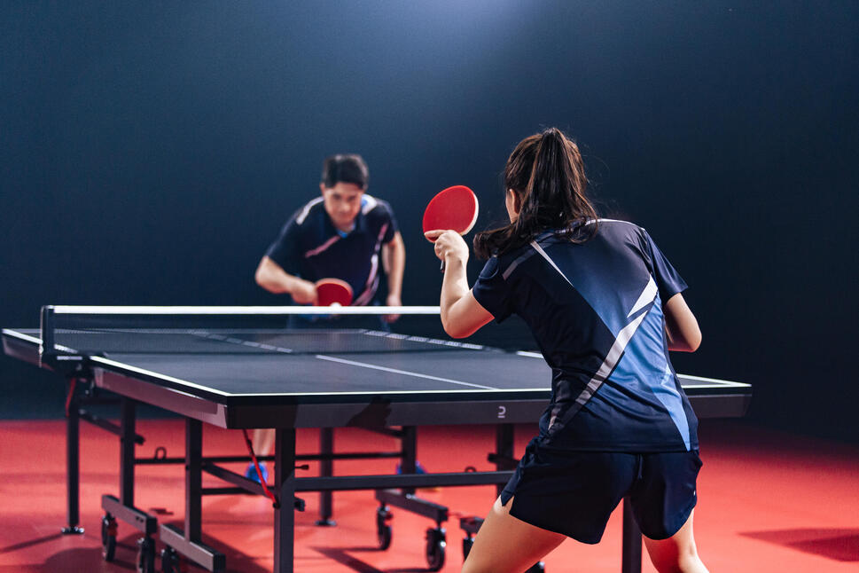
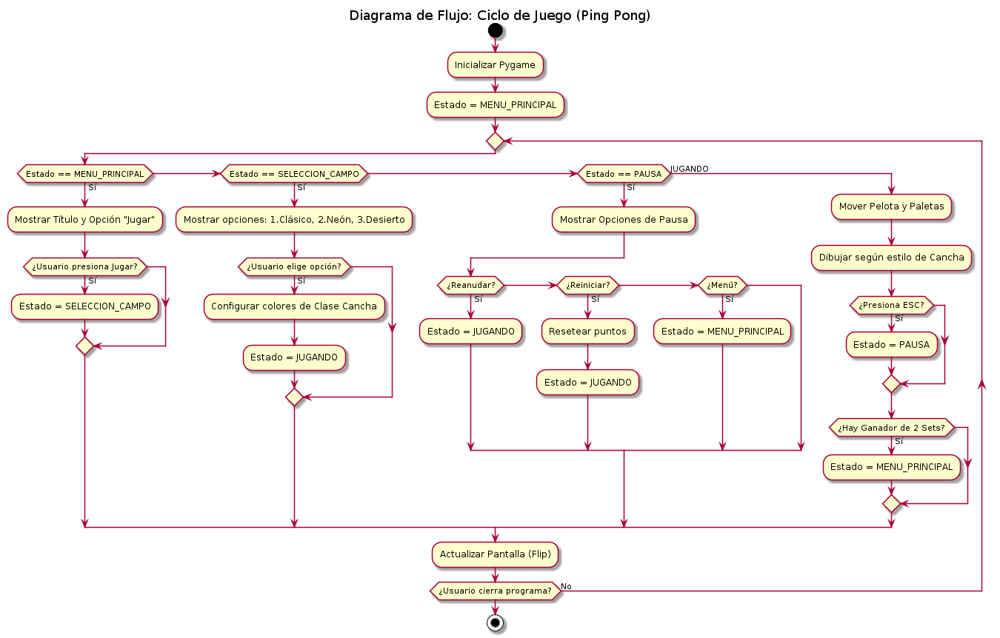
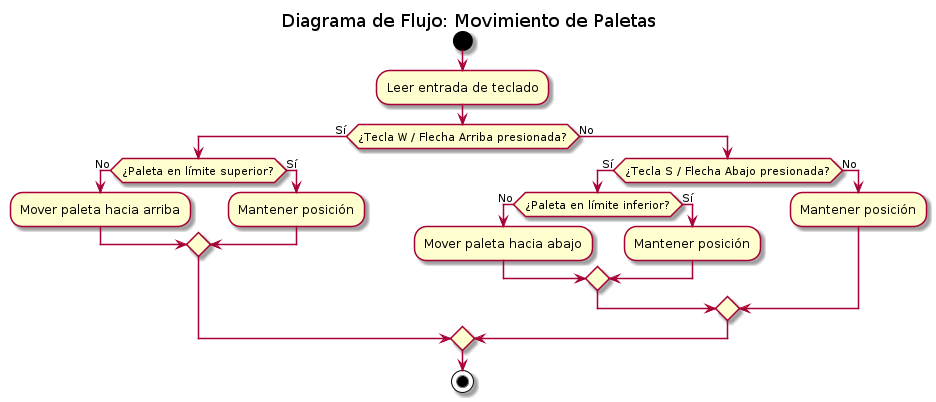
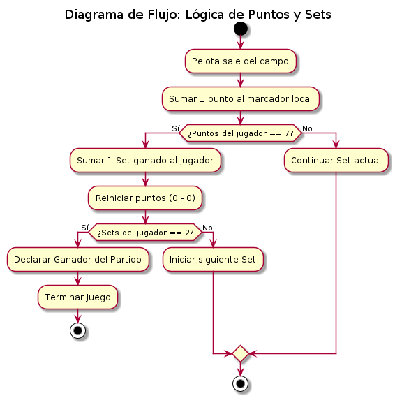
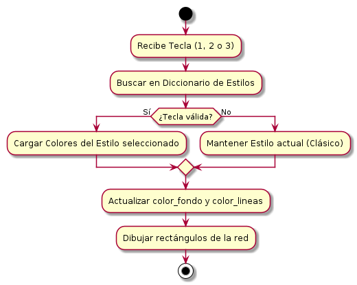
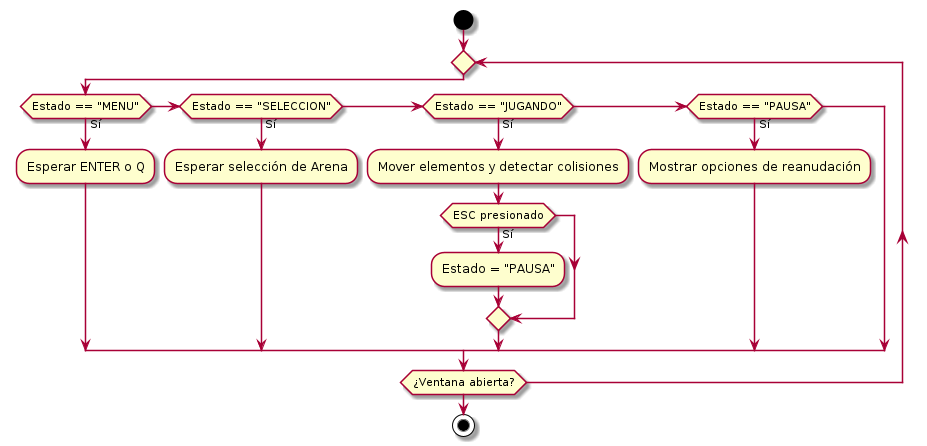
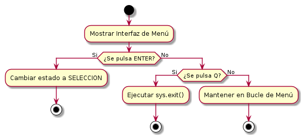

= [blue]#🏓 PROYECTO PING PONG 🏓#
:icons: font
:source-highlighter: rouge
:toc: left
:toc-title: Contenidos

== *Autores*
* Jose Gerardo
* Diego Herrera
* Luis Marin
* Nohemy Trejo
* Angel Armas

== *Problema*
El usuario requiere un juego de Ping Pong interactivo para dos jugadores reales que permita competir en una serie de sets, utilizando una interfaz gráfica y siguiendo el paradigma de Programación Orientada a Objetos.

== *Requerimientos*

=== *Requerimientos Funcionales*
* Sistema de juego para 2 jugadores reales de forma local.
* Controles Jugador 1: Teclas W (Arriba) y S (Abajo).
* Controles Jugador 2: Flecha Arriba y Flecha Abajo.
* Lógica de puntuación:
** Un Set se gana al alcanzar 7 puntos.
** El partido se gana al obtener 2 de 3 sets.
* Comportamiento de la pelota:
** Rebote en límites superiores e inferiores.
** Rebote en paletas de jugadores con incremento de velocidad.

=== *Requerimientos No Funcionales*
* Sistema Operativo: Debian 13.
* Paradigma de programación: POO (Orientado a Objetos).
* Lenguaje: Python 3.
* Interfaz Gráfica: GUI mediante la librería Pygame.
* Documentación: Formato Asciidoctor (.adoc).

== *Diseño*

=== *Diagrama de Funcionamiento General*

*Descripción:* Representa el flujo principal de la aplicación. Gestiona el ciclo de vida del programa desde el inicio hasta el cierre, conectando los menús de inicio con el núcleo del juego y los estados de transición como la pausa.

=== *Diagrama de Paletas*

*Descripción:* Explica la lógica de movimiento de los jugadores. El sistema detecta constantemente las entradas de teclado (W/S para el Jugador 1 y Flechas para el Jugador 2) y valida que la posición de la paleta no exceda los límites verticales de la pantalla de juego.

=== *Diagrama de Marcador*

*Descripción:* Define las reglas de victoria y puntuación. Cada vez que la pelota cruza un límite lateral, se suma un punto al oponente. Al alcanzar los 7 puntos, se otorga un set al jugador y se reinicia el contador parcial; la partida finaliza cuando un jugador gana 2 de 3 sets.

=== *Diagrama de Cancha*

*Descripción:* Gestiona la personalización visual de la arena. Utiliza un diccionario de datos para cambiar dinámicamente los colores de fondo y de las líneas decorativas según la tecla numérica (1, 2 o 3) presionada por el usuario en el menú de selección.

=== *Diagrama de Juego*

*Descripción:* Detalla el funcionamiento de la "Máquina de Estados". Esta lógica coordina qué procesos deben ejecutarse en cada frame: desde el procesamiento de físicas y colisiones en el estado JUGANDO, hasta el renderizado de interfaces estáticas en MENÚ o PAUSA.

=== *Diagrama de Menú*

*Descripción:* Controla la navegación y la interacción inicial del usuario. Permite el desplazamiento entre la pantalla de título y la selección de escenario, además de incluir la lógica de salida segura del sistema mediante la función `sys.exit()`.

== *Guía de Instalación*

Este proyecto requiere **Python 3.x** para funcionar. Siga estos pasos para preparar el entorno en Debian:

=== 1. Instalar Python (Si no lo tiene)
Abra su terminal y ejecute el siguiente comando para instalar Python y el gestor de paquetes pip:
[source,bash]
----
sudo apt update && sudo apt install python3 python3-pip -y
----

=== 2. Instalar dependencias del proyecto
Una vez tenga Python, instale la biblioteca Pygame utilizando el archivo de requerimientos:
[source,bash]
----
pip install -r requirements.txt
----

=== 3. Ejecutar el juego
Para iniciar el programa, sitúese en la carpeta raíz del proyecto y ejecute:
[source,bash]
----
python3 app/main.py
----
