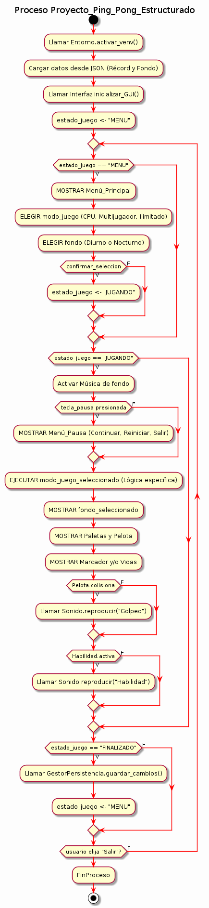
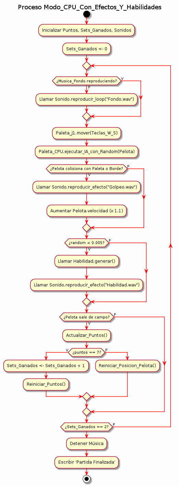
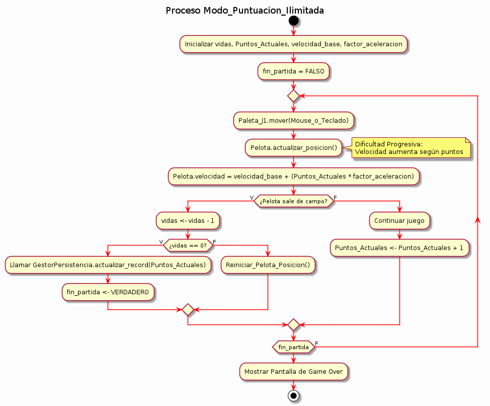
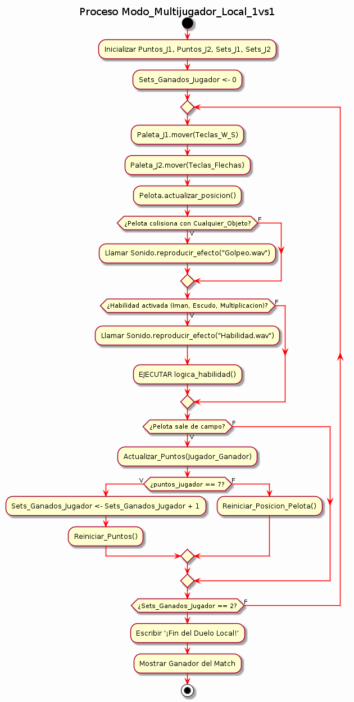
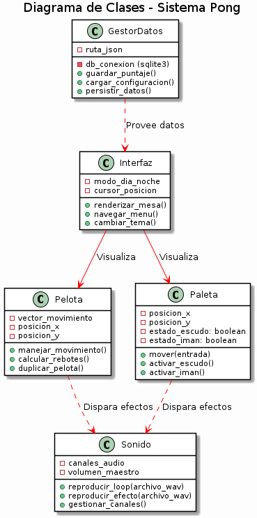

= [blue]#🏓 PROYECTO PING PONG 🏓#
:icons: font
:source-highlighter: rouge
:toc: left
:toc-title: Contenidos

// Nota: Asegúrate de tener esta imagen en la carpeta recursos o comenta la línea
// image::recursos/img-banner.jpg[width=600, align="left"]

== *Autores*
* Jose Arrieta
* Kleyderberg Marin
* Jose Medina
* Sebastian Rodriguez
* Fabricio Castillo

== *Problema*
El proyecto consiste en desarrollar un simulador de Ping Pong avanzado en Python/Pygame para Debian 13, que supere la mecánica clásica mediante el uso de POO. El sistema debe integrar un motor de habilidades especiales (Imán, Escudo, etc.), un modo contra la IA y gestión de base de datos para rankings. Se requiere una arquitectura profesional bajo entornos virtuales y documentación en Asciidoctor, garantizando un software competitivo, escalable y persistente.

=== *Requerimientos Funcionales*
* Sistema de juego para 2 jugadores reales de forma local.
** Controles Jugador 1: Teclas W (Arriba) y S (Abajo).
** Controles Jugador 2: Flecha Arriba y Flecha Abajo.
* Lógica de puntuación:
** Un Set se gana al alcanzar 7 puntos.
** Modo de puntuación infinito para un ranking.
** El partido se gana al obtener 2 de 3 sets.
* Comportamiento de la pelota:
** Rebote en límites superiores e inferiores.
** Rebote en paletas de jugadores con incremento de velocidad.
* Navegación con cursor.
* Personalización dinámica.
* Modo vs PC.
* Gestión de habilidades:
** Velocidad aumentada.
** Multiplicación de la pelota.
** Escudo defensivo.
** Imán: Durante 5 segundos, la pelota se siente atraída por el centro de tu paleta.

=== *Requerimientos No Funcionales*
* Sistema Operativo: Debian 13.
* Paradigma de programación: POO (Orientado a Objetos).
* Lenguaje: Python 3.
* Interfaz Gráfica: GUI mediante la librería Pygame.
* Documentación: Formato Asciidoctor (.adoc).
* Base de datos: Para guardar la puntuación.
* Entorno virtual: venv.

== *Diseño*

=== *Diagrama de Funcionamiento General*

*Descripción:* Representa el flujo principal de la aplicación. Gestiona el ciclo de vida del programa desde el inicio hasta el cierre.

=== *Diagrama de CPU (IA)*

*Descripción:* Explica la lógica de movimiento y toma de decisiones del oponente controlado por la computadora.

=== *Diagrama de Puntuación Ilimitada*

*Descripción:* Define las reglas para el modo infinito y el registro de récords en el ranking.

=== *Diagrama Multijugador*

*Descripción:* Gestiona la entrada de datos simultánea para ambos jugadores locales.

=== *Diagrama de Clase*

*Descripción:* Estructura de objetos, atributos y métodos del sistema.

== *Guía de Instalación*

Este proyecto requiere **Python 3.x** para funcionar. Siga estos pasos para preparar el entorno en Debian:

=== 1. Instalar Python (Si no lo tiene)
Abra su terminal y ejecute el siguiente comando:
[source,bash]
----
sudo apt update && sudo apt install python3 python3-pip python3-venv -y
----

=== 2. Configurar el entorno virtual e instalar dependencias
[source,bash]
----
python3 -m venv venv
source venv/bin/activate
pip install -r app/requeriments.txt
----

=== 3. Ejecutar el juego
Para iniciar el programa, ejecute:
[source,bash]
----
python3 app/main.py
----
